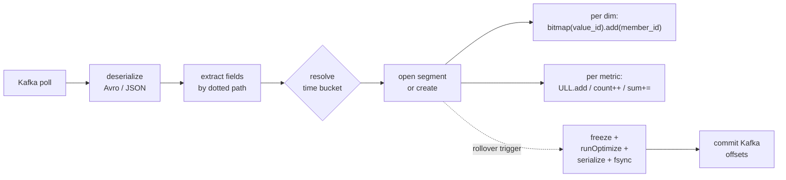
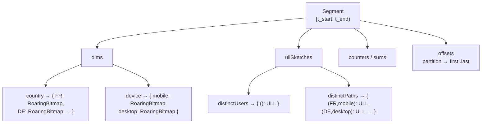
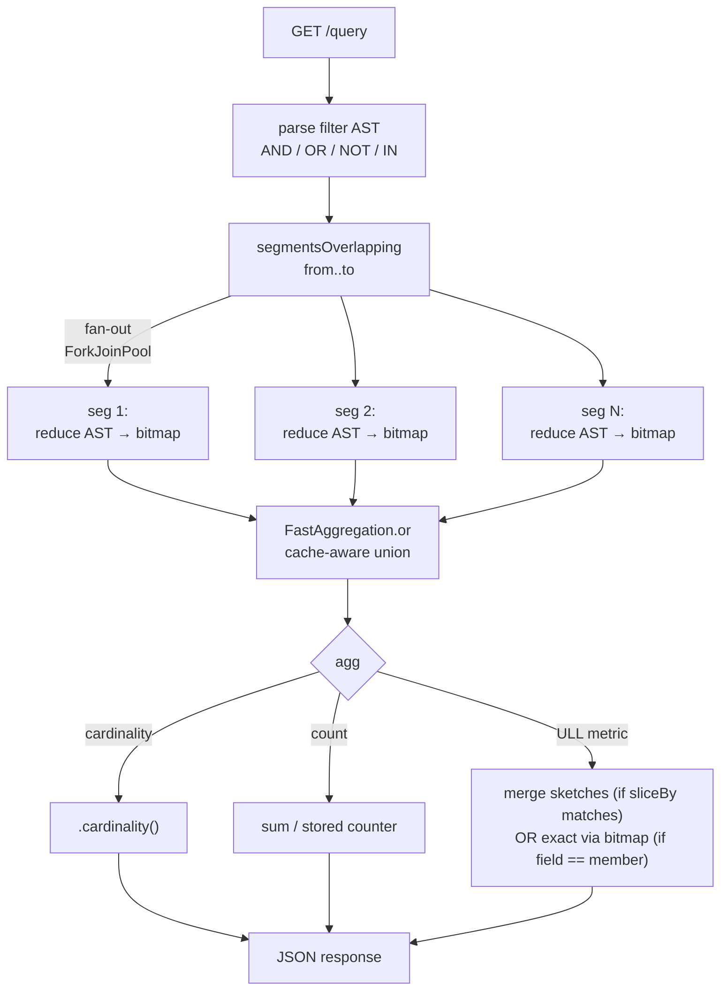

# kafka-roaring-indexer

An experiment: what does the smallest useful pre-aggregated analytics index over a Kafka topic look like, built as a pure consumer sidecar, using Roaring bitmaps for exact filters and UltraLogLog sketches for approximate distinct counts?

No broker fork. No schema changes. No fleet of OLAP services. One YAML, one process, one HTTP endpoint.

## The problem

Kafka is a log. Analytics questions are not log questions.

> *How many distinct users in FR, on mobile, hit a 5xx in the last hour?*

To answer that with only Kafka, you scan. Every time. Or you push everything into a full OLAP engine — Druid, Pinot, ClickHouse, Snowflake — which solves the problem but drags along a distributed cluster, an ingestion pipeline, a schema catalog, a query planner, a cost center. For a handful of dashboards and alerts, that's three orders of magnitude too much machinery.

The interesting gap sits in the middle. Pick the right two data structures — bitmaps for set membership, sketches for cardinality — organise them by time bucket, and you can answer the *actual questions product teams ask* in milliseconds on billions of records, from a single-process sidecar that a team can reason about end to end.

## The bet

Two data structures do most of the work:

- **Roaring bitmaps** — one bitmap per `(dimension, value)` pair per time bucket, storing the set of members (usually user ids) that matched. Exact. AND / OR / NOT become one-to-three-nanosecond-per-word SIMD set operations. Compressed. Widely-used (Druid, Pinot, Lucene internals).
- **UltraLogLog** — an ~800-byte probabilistic sketch with ~0.8% error for distinct-count on high-cardinality fields where you cannot afford to store a bitmap per value. Mergeable across time buckets. Idempotent under replay.

One member type per indexer (the entity whose membership is tracked — typically `userId`). A dimension is a declared path into the record with a chosen encoding (`dict` / `raw_uint32` / `hash32` / `hash64`). Segments are time-bucketed, immutable once rolled, fsynced to disk before their Kafka offsets commit.

That's the whole model. Everything else is plumbing around it.



Per segment on disk, the data model is one bitmap per `(dimension, value)` pair over a uint32 member space, plus a handful of sketches and scalar counters:



## The use case

Think of a product analytics stream on a Kafka topic: one record per user event, maybe 10k–100k msg/s, a dozen dimensions (country, device, path, status, experiment bucket, …), retained for 30 days.

Things this indexer answers cheaply:

- **Distinct users matching a filter**, exact.
  `country:FR,DE AND device:mobile AND NOT status:5xx` → milliseconds.
- **Distinct-of-other** (e.g. distinct paths visited), approximate via ULL.
- **Counts, sums** per filter — the usual "how many requests in this time window with this shape?"
- **Multi-dim filtering with AND / OR / NOT / IN** over a time range spanning up to `maxSegmentsPerQuery` buckets.
- **Crash / restart / replay** without double-counting, because `bitmap.add()` is idempotent and offsets commit only after segment fsync.

Things it deliberately does **not** do:

- Full SQL.
- Joins. Windowed aggregations beyond the time-bucket boundary.
- Distributed queries. One process, one topic, one member type.
- Exact count-distinct on fields without an explicit dict (use a sketch or pick your encoding).

The design note lives in [`SPEC.md`](SPEC.md). The DSL is a single YAML validated against [`schema/indexer.schema.json`](schema/indexer.schema.json) — a full example in [`examples/events-analytics.yaml`](examples/events-analytics.yaml).

## What's interesting in the design

A few choices that aren't obvious:

- **Offsets commit *after* segment fsync.** The simplest invariant that gives replay-safety without needing exactly-once or transactions. A crash loses the tail in the active segment, which `bitmap.add()` idempotency lets us safely re-consume.

  ```mermaid
  sequenceDiagram
    participant C as Consumer
    participant S as Segment RAM
    participant D as Disk
    participant K as Kafka
    C->>S: add partition offset record
    Note over S: bitmap.add memberId<br/>ULL.add hash
    S->>S: rollover trigger
    S->>D: serialize + fsync rbi ull count
    D-->>S: durable
    S->>K: commitSync offsets
    Note over C,K: crash before commit:<br/>replay from last committed offset<br/>add is idempotent so safe
  ```

- **Per-dim encoder chosen at config time.** Dict when you'll filter on exact values. Raw uint32 when the field already fits. Hash32/64 when cardinality is huge and you only need equality, not ground truth (with the collision caveat spelled out in the config comment).
- **Filter grammar kept minimal.** AND / OR / NOT / IN, values expanded inside a dimension. Range predicates collapse into bucketed numeric dims (`linear` / `exponential` / `explicit`), which means range queries reduce to Roaring `OR` over pre-computed bucket bitmaps.
- **Portable Roaring on disk.** `.rbi` files are cross-language inspectable — no runtime lock-in.
- **Member dictionary is append-only, ever.** Cardinality guards per dimension, with `reject` / `overflow` / `halt` semantics. A dim blowing up its cardinality does not silently poison the segment.
- **Queries fan out, writes keep flowing.** Segment evaluation is a pure map/reduce: per-segment filter → `RoaringBitmap`, then `FastAggregation.or` across segments. Above a configurable threshold (`query.parallelThreshold`, default 8) the fan-out goes parallel on a dedicated `ForkJoinPool` sized by `query.parallelism`. Frozen segments are handed out as-is (their bitmaps are immutable); the currently-open segment is read under a read-lock that clones each touched bitmap so a concurrent `bitmap.add()` on the writer thread cannot corrupt the query's view. Single-writer, many-readers, no stop-the-world.

Deliberately skipped in v1, flagged in the task list: ART backing for the dict (prefix filters + radix compression on clustered keys), `Int2ObjectOpenHashMap` for the value-id map (quick RAM win), Z-order for multi-range numeric dims.

## The shape of a query

```
GET /query
    ?from=2026-04-24T00:00:00Z
    &to=2026-04-24T23:00:00Z
    &filter=country:FR,DE AND device:mobile AND NOT status:5xx
    &agg=cardinality
```

```json
{ "segments": 24, "matched": 48211, "result": 48211, "metric": "cardinality", "approx": false }
```

Under the hood: find the segments overlapping `[from, to)`, **fan out** filter evaluation across them (parallel on `ForkJoinPool` once `segments.size ≥ parallelThreshold`), each segment reduces the filter AST into a `RoaringBitmap` from its pre-built dim-value bitmaps, then **gather** via `FastAggregation.or` — the cache-aware multi-way union beats a sequential fold. For cardinality the result is `.cardinality()` of the merged bitmap; for ULL metrics we either merge pre-computed sketches (approximate, requires exact-slice-match) or rebuild exactly from the matched bitmap when `metric.field == member.field`.



Concurrency with the writer: the consumer thread keeps ingesting into the open segment while queries run. Frozen segments are bitmap-immutable (no lock needed). The open segment is queried under a shared read-lock that clones each touched bitmap inside the lock window — the writer continues to mutate the live bitmaps under a per-bitmap `synchronized` guard, and the query operates on snapshots. Reads and writes don't serialize against each other; only `freeze()` (rollover) takes the write-lock and waits for in-flight reads to finish.

## Prior art, positioning

Druid, Pinot, ClickHouse, FeatureBase (ex-Pilosa) all use Roaring under the hood for posting lists — they're what you reach for when this sidecar is no longer enough. Tantivy / Lucene / Quickwit do the same inside search engines. Kafka Streams / ksqlDB occupy a different axis: streaming SQL transformations, not pre-aggregated indexes.

Closest cousin in spirit: **FeatureBase (Pilosa)**. Same mental model — "bitmap database" indexing declared dimensions for set-theoretic analytics, not full-text.

Often confused with us but genuinely different: **Quickwit**. Quickwit is a distributed search engine on Tantivy (Rust-Lucene) with Kafka sources; it scans posting lists and answers "find events matching". We are pre-aggregated per `(dim, value)` with the **member** as a first-class citizen, so we answer "how many **distinct users** match this filter" as one-to-three SIMD operations instead of a scan. Quickwit wins on log search, ad-hoc fields, and object-storage scale. We win on sub-millisecond distinct-cardinality on a declared, opinionated schema, from a single process.

The niche here: **single-binary, consumer-side, declarative, opinionated**. Not a Druid replacement. A pragmatic middle ground when spinning up an OLAP cluster is overkill and scanning Kafka is underkill.

## Status

POC implementation complete against `SPEC.md` milestones M1 through M11. Design doc is intentionally ahead of the code: several knobs (protobuf Schema Registry, zstd segment compression, multi-partition ownership on rebalance, dict snapshot cadence) are sketched but not load-bearing yet.

## License

TBD.
